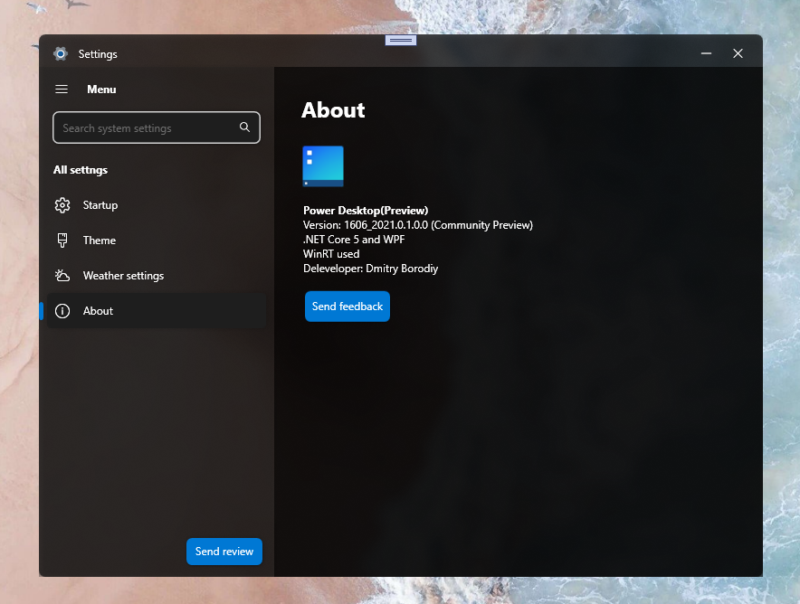
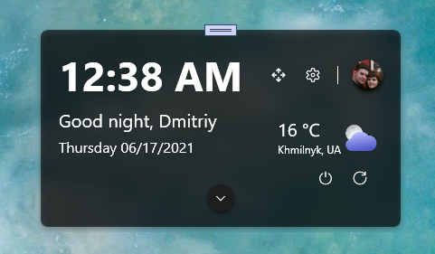

<h2>Power Desktop</h2>

    Explore the new experience of Windows Desktop. 
    More simple, more effective, more #Fluent. 
      

<h3 style="font-size: 20px;">The announce is coming///<h3/> 

    Community Preview only for imaging! 
    Enjoy new Desktop features right now! 

    What's new in Community Preview 0.1.0.0 
    - Preview features 
    - Location detect 
 
    <h3>Screenshots</h3>
 

 

 
<h1>Enjoy new Desktop!☺️☺️☺️</h1>
