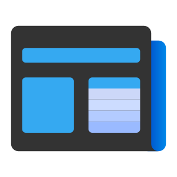
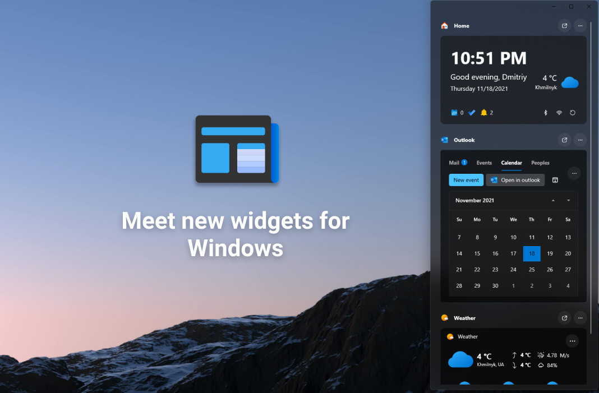

    

 
<h1>Power Widgets - customize your at-a-glance info</h1>

    Power Widgets is new way to customize your at-a-glance info. With new widgets and mini-apps you can explore info and get fast access to important things.
      

    

 
<h2><a href="https://dmitryborodiy.github.io/PowerDesktop/www/download.html">Get Power Widgets</a></h2> 
<a href="https://twitter.com/DmitriyJulia/status/1405904623114899459?s=20">Get from Microsoft Store</a>
 
<a>How to get it on Windows 11 SE?</a>
 
 
<a>Is Windows 10 supported?</a>

Yes!

 
 
<h2>What you need to know?</h2>

     
    <b>What is mini-apps?</b> 
     
    Mini-apps are replacements for old live tiles. We make sure that you can access important information for you without being distracted by launching applications. You can now interact with the Outlook widget and reply to mail or create calendar events with just a few clicks right from the widget panel. 
     
    <b>What if I already have a live tile-supported UWP app?</b> 
     
    We are currently working on supporting third-party UWP applications. 
     
    <b>What devices do you plan to support the Power Widgets Platform on?</b> 
    <li>Windows 10</li>
    <li>Windows 10 for Team</li>
    <li>Windows 10 on Xbox</li>
    <li>Windows 10 on HoloLens</li>
    <li>Windows 10 for ARM</li>
    <li>Windows 10 S and Education Edition</li>
    

    <li>Windows 10 LTSC (Not from Store without auto-updates)</li>
    

    <li>Windows 11</li>
    <li>Windows 11 on Xbox</li>
    <li>Windows 11 SE</li>
     
     
    <b>Where Power Desktop?</b>
     
     
    Power Desktop is no longer supported and has been superseded by the current project. 
     
    <b>If I already bought Power Desktop, can I upgrade and get Power Widgets for free?</b> 
     
    If you have already purchased Power Desktop earlier, you can upgrade for free and get Power Widgets. The update is free for students. Read more about how to get Power Widgets on Windows 10 LTSC and SE. 
     
    <a>Learn more about support on LTSC and SE versions of Windows ></a>

