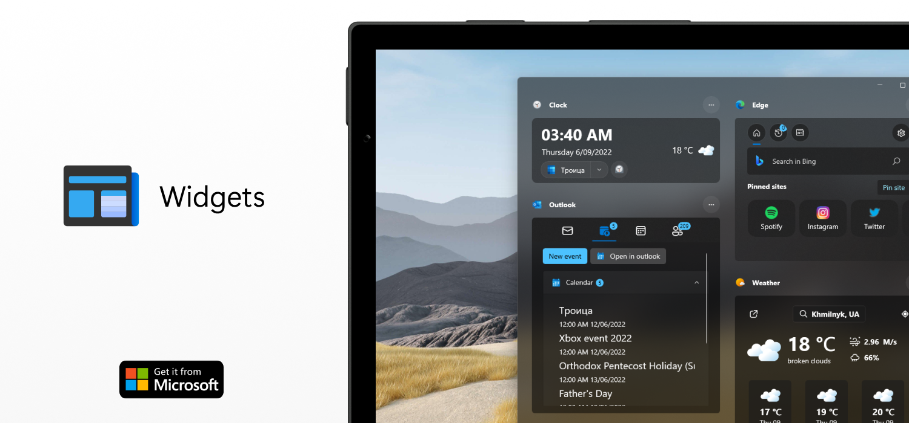

 

<h1 style="margin-top: 20px;">Power Widgets</h1>

Explore the new experience of your widgets feed.
More simple, more effective, more #Fluent. Meet the new widgets for Windows!
Increase your productivity with new widgets for Windows devices. Don't miss out on important things, get quick access to important information and tools. With the new widgets feed, you can keep important information close at hand. Try new widgets now!

<a href="https://dmitryborodiy.github.io/PowerWidgets/home.html">
    <button style="color: white; background-color: #0078D7; border: none; border-radius: 4px; height: 32px; width: 126px;">Product web site</button>
</a>
<a href="https://twitter.com/dev_dmitriy">
    <button style="color: white; background-color: #282828; border: none; border-radius: 4px; height: 32px; width: 136px;">Follow in Twitter</button>
</a>
<a href="mailto:dima.borodiy@outlook.com">
    <button style="color: white; background-color: #282828; border: none; border-radius: 4px; height: 32px; width: 110px;">Send review</button>
</a>

<h2 style="margin-top: 20px;">What's new in 1.6 update?</h2>

• Sticky notes feature 
• Updated Microsoft Edge widget 
• Microsoft Edge web bar 
• Updated clock widget 
• Updated Outlook widget 
• Added new features for working with mail 
• New opportunities for working with contacts 
• Updated weather widget 
• Redesigned weather icons 
• Added new customization features for the action bar 
• Custom date &amp; time formats fixed 
• Redesigned first setup view 
• Bug fixes and stability improvements</TextBlock>

<h2 style="margin-top: 20px;">What's new in 1.6.1 update?</h2>

• Attach people to notes feature 
• Bug fixes and stability improvements 
• Actions bar improvements 
